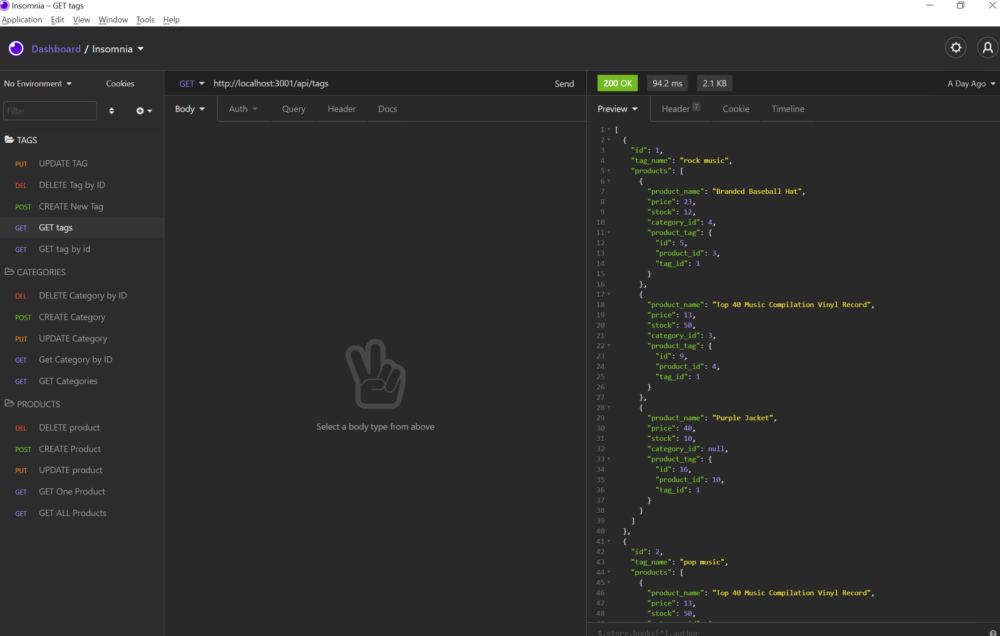
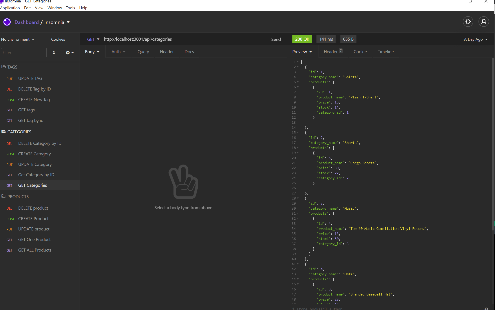
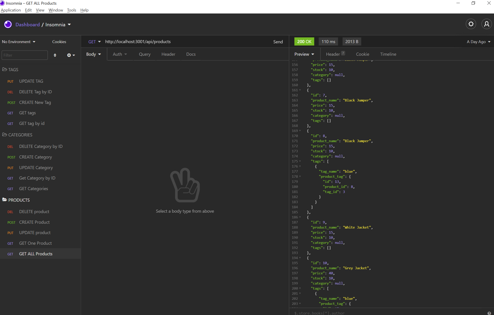

# E-Commerce-Back-End

[](https://opensource.org/licenses/MIT)

## Description
The E-Commerce Backend is a mysql database and application backend for an e-commerce site. This application has been built using MySQL2, Express, Sequelize and dotenv. Insomnia Core is utilized to demonstrate the functionalities of this application. 

Link to the video Demo: [Video Demo](https://youtu.be/hzJOceYWJ4Y). 





## Table of Contents
- [Installation](#installation)
- [Usage](#usage)
- [License](#license)
- [Contributing](#contributing)
- [Credits](#credits)
- [Tests](#tests)
- [Questions](#questions)

## Installation 

Clone these files from the GitHub repository via your preferred means. Then make sure to install necessary dependencies by running the following commands:
```
npm init
```
```
npm install mysql2
```
```
npm install sequelize
```
```
npm install dotenv
```

## Usage
Once the files have been pull down to your preferred repository, run this application by inputting the following commands into your bash terminal. 
```
mysql -u root -p
```
```
source db/schema.sql
```
```
quit
```
```
npm run seed
```
```
npm start
```

The server will start. You can then view the application in the Insomnia Core.

## License
This project is licensed by the [MIT](https://opensource.org/licenses/MIT) license

## Contributing 
If this project is of interest to you, please contact me with a detailed description of how you would like to contribute prior to any pull requests.

## Credits

http://expressjs.com/en/api.html

https://sequelize.org/master/index.html

https://www.npmjs.com/package/dotenv

https://www.npmjs.com/package/mysql2

https://www.w3schools.com/mysql/

## Tests 
To ensure that this application is running correctly, please inform me of any issues via the provided contact details.

## Questions
If you have any questions or require further clarification then please contact me at:
- https://github.com/Shelbyrp/
- shelby.pignat@gmail.com